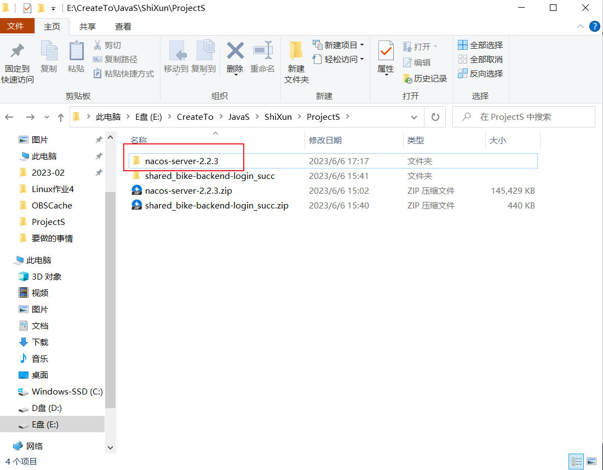
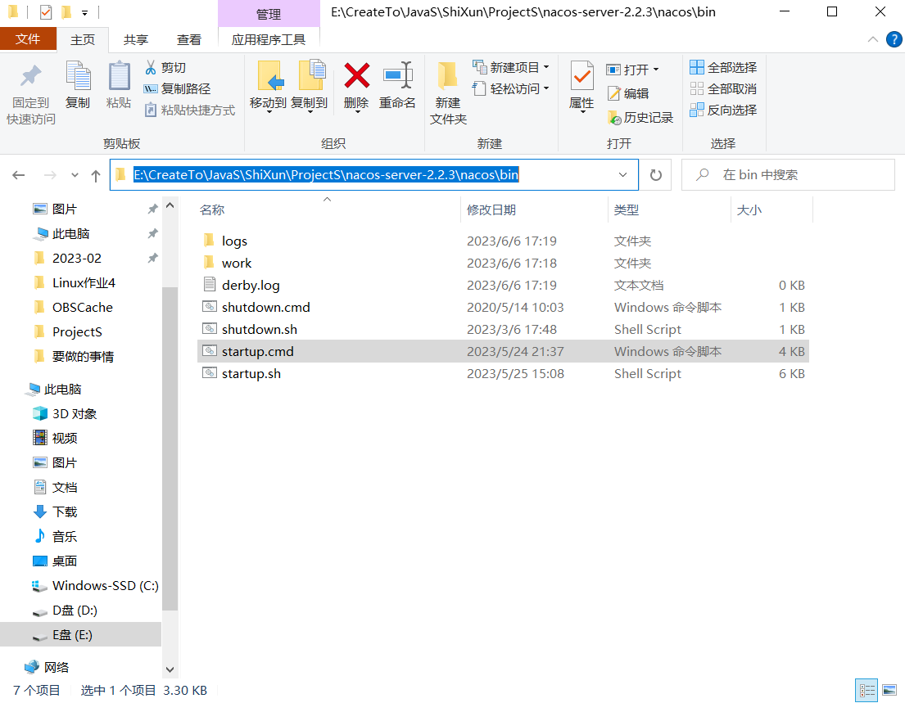
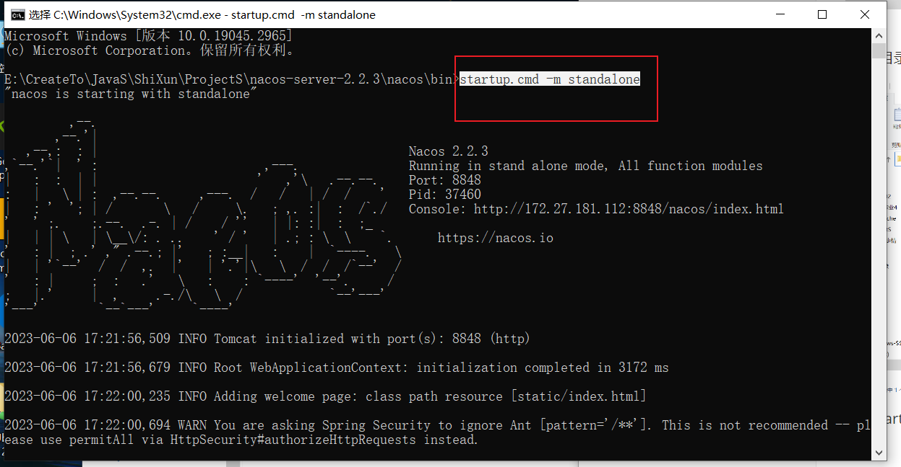
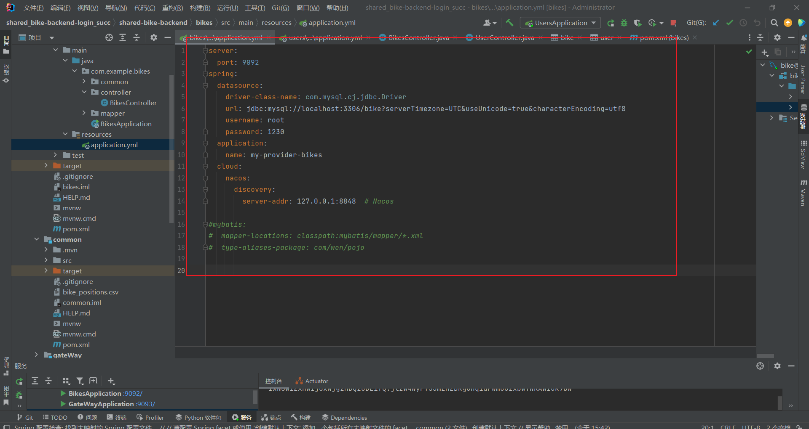
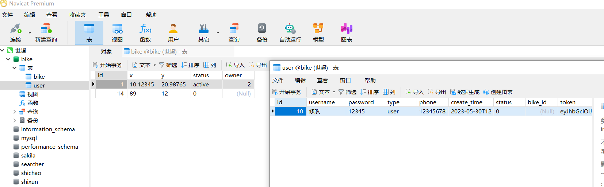

# shared_bike-backend

共享单车的后端

# 后端安装文档-解世超

## 1.需要的环境支持清单

基本上配置在后端中已经写好。

java8，jdk1.8；

其他的插件在maven中；

nacos-server2.2.2；

## 2.关于nacos安装

下载并解压，

在bin目录开启cmd窗口：

键入startup.cmd -m standalone命令本地启动：

## 3.关于数据库

这是我的配置，记得改成自己的用户名密码

运行相应的sql脚本并连接数据库就行。

